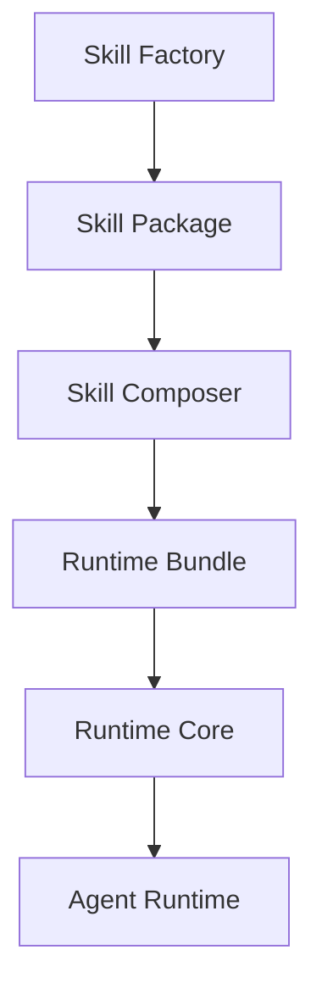

# Skill Cortex

[](https://github.com/alvarolorentedev/crazy-coding-llm/actions/workflows/pytest.yml)
[](https://github.com/alvarolorentedev/crazy-coding-llm/actions/workflows/demo.yml)
[](LICENSE)
[](pyproject.toml)

Skill Cortex is a package manager and runtime for AI coding capabilities.

Instead of shipping one larger fine-tune, Skill Cortex packages specialized LoRA
skills as self-describing artifacts, composes those artifacts into deterministic
runtime bundles, and runs local coding workflows on top of the same runtime
core.

The package is the unit of distribution.
The runtime bundle is the unit of deployment.
The runtime is the unit of execution.

## Why Skill Cortex?

Most coding-agent stacks treat model adaptation, deployment, and agent behavior
as one opaque system. Skill Cortex separates those concerns:

- package a capability once as a reusable skill artifact
- compose multiple skills into one runtime bundle without mutating source assets
- validate the bundle before inference or serving
- run a bounded local agent against the same runtime the CLI and server use

## Product Overview

Skill Cortex v0.1 ships one narrow but complete path from checked-in adapters to
an executable local agent workflow:



### Product layers

- Skill Factory: package an adapter plus provenance into a validated skill
  artifact
- Skill Composer: combine validated skill packages into a deterministic runtime
  bundle
- Runtime Core: validate, route, infer, and serve from a runtime bundle
- Agent Runtime: run a bounded local repository task loop on top of Runtime Core

Deep-dive docs:

- [Skill Factory](docs/architecture/skill-factory.md)
- [Skill Composer](docs/architecture/skill-composer.md)
- [Runtime Core](docs/architecture/runtime-core.md)
- [Agent Runtime](docs/architecture/agent-runtime.md)
- [Skill Package Contract](docs/skill-package-contract.md)
- [Repo Boundary Map](docs/repo-boundary-map.md)

## Support Matrix

| Scenario | Status | Notes |
| --- | --- | --- |
| Package, compose, validate, and no-model demo | Supported | Documented for macOS with Python 3.11+ |
| Real runtime inference | Supported with constraints | Requires model-compatible local environment; current local stack is Apple Silicon-first because of `mlx-lm` |
| Compatibility server | Supported | Minimal, non-streaming OpenAI-compatible surface |
| Bounded local agent | Supported | Local single-run workflow only |
| Linux and Windows | Not yet documented | Treat as experimental until verified and documented |

## Install

### Recommended local setup

```bash
python3 -m venv .venv
. .venv/bin/activate
pip install --upgrade pip
pip install -e '.[test]'
```

Check the canonical public CLI:

```bash
python -m skillcortex --help
```

### Platform guidance

- Python 3.11+ is required
- The documented no-model demo avoids model downloads and weight loading
- Real model execution currently follows the repository's Apple Silicon-first
  `mlx-lm` environment

## Quickstart: No-Model Demo

A first-time developer should start here. This flow uses checked-in fixtures,
checked-in adapter artifacts, and dry-run runtime/agent steps.

```bash
DEMO_ROOT="$(mktemp -d "${TMPDIR:-/tmp}/skillcortex-demo.XXXXXX")"
python scripts/run_skillcortex_demo.py --output-root "$DEMO_ROOT"
```

What the demo validates:

- packaging existing adapters into self-describing skill packages
- composing those packages into one runtime bundle
- validating the runtime bundle before execution
- dry-run routing for inference without loading a model
- bounded agent control flow against a local repository

Expected outputs under `$DEMO_ROOT`:

```text
python_skill/
debugging_skill/
runtime/
agent-trace.json
```

For the command-by-command version of the same flow, see [examples/README.md](examples/README.md).

## Optional Local Validation: Arbitrary Skill Smoke

Keep the no-model demo above as the default quickstart. Use this separate flow only when you want to validate the product path for an arbitrary skill ID such as `fastapi_contract`.

Default no-model arbitrary-skill smoke:

```bash
SMOKE_ROOT="$(mktemp -d "${TMPDIR:-/tmp}/skillcortex-fastapi-contract.XXXXXX")"
python scripts/run_skillcortex_arbitrary_skill_smoke.py --output-root "$SMOKE_ROOT"
```

What the default smoke validates:

- package-first arbitrary skill metadata for `fastapi_contract`
- compose without registry
- runtime bundle validation
- inference dry-run against the composed bundle
- bounded agent dry-run against a local toy repository

Opt-in real local training smoke:

```bash
SMOKE_ROOT="$(mktemp -d "${TMPDIR:-/tmp}/skillcortex-fastapi-contract-real.XXXXXX")"
python scripts/run_skillcortex_arbitrary_skill_smoke.py --output-root "$SMOKE_ROOT" --real-training
```

What the opt-in path additionally validates:

- `skillcortex train-skill --skill-id fastapi_contract` using the tiny fixture in [examples/fastapi_contract_tiny/README.md](examples/fastapi_contract_tiny/README.md)
- real local trainer execution
- real local evaluator execution before packaging

Local assumptions and expected runtime:

- This path is Apple Silicon-first because the repository training stack is built around `mlx-lm`.
- Expect the real-training path to be slow compared with the no-model demo. Runtime depends on local hardware, Python environment, and whether model weights must download on first use.
- Treat the real-training path as a manual smoke check, not a normal development loop.
- To skip it, do nothing extra: the default public quickstart and the default arbitrary-skill smoke both avoid real training.
- This path is not part of normal CI and should not be added to default test commands.

## CLI Overview

Skill Cortex ships one public CLI with command-specific help and examples.

| Command | Purpose |
| --- | --- |
| `skillcortex generate-dataset` | generate deterministic train/eval JSONL datasets for product `train-skill` |
| `skillcortex validate-dataset` | validate product train/eval datasets and write a report JSON |
| `skillcortex train-skill` | train a new LoRA skill from datasets and package it as a Skill Cortex artifact |
| `skillcortex package-skill` | package an already-trained adapter into a self-describing skill artifact |
| `skillcortex validate-skill-package` | verify package structure, fingerprints, and protected inputs |
| `skillcortex compose-skills` | compose validated skill packages into a deterministic runtime bundle |
| `skillcortex route` | route a task against discovered skill packages without loading adapters |
| `skillcortex validate-runtime` | verify a runtime bundle before inference or serving |
| `skillcortex infer` | run local inference or dry-run routing against a runtime bundle |
| `skillcortex serve` | expose the minimal OpenAI-compatible compatibility server |
| `skillcortex agent run` | run the bounded local agent workflow against a local repository |

Use `skillcortex <command> --help` for command-specific examples.

## Common Workflows

### Generate, train, compose, and infer

The beginner path starts with deterministic dataset generation, then training, composition, and inference. The generic product dataset contract is JSONL with one row per example using required fields `id`, `task_type`, `prompt`, and `target`. Optional fields such as `execution`, `group`, `metadata`, `skills`, and `semantic_family` are preserved when present.

`skillcortex generate-dataset` writes both train and eval datasets using that schema, then emits a dataset report JSON with counts, warnings, SHA-256 hashes, diversity stats, leakage results, and example previews.

```bash
skillcortex generate-dataset \
  --skill-id fastapi_contract \
  --domain fastapi
```

Defaults for the beginner command are `task_type=python_generation`, `num_examples=100`, `seed=42`, `output=datasets/<skill_id>/train.jsonl`, and `eval_output=datasets/<skill_id>/eval.jsonl`. Advanced users can still override any of those flags explicitly.

`train-skill` runs dataset validation as a mandatory preflight and fails early on malformed, duplicate, leaky, or obviously degenerate datasets.

```bash
skillcortex train-skill \
  --skill-id fastapi_contract \
  --name "FastAPI Contract Skill" \
  --train-dataset datasets/fastapi_contract/train.jsonl \
  --eval-dataset datasets/fastapi_contract/eval.jsonl \
  --output skills/fastapi_contract
```

```bash
skillcortex compose-skills \
  --skills skills/fastapi_contract \
  --output runtime/fastapi_contract
```

```bash
skillcortex infer \
  --runtime runtime/fastapi_contract \
  --prompt "Create a FastAPI POST endpoint for invoices with request validation." \
  --dry-run
```

If you want an explicit dataset quality gate before training, run the optional validator yourself:

```bash
skillcortex validate-dataset datasets/fastapi_contract/train.jsonl \
  --eval-dataset datasets/fastapi_contract/eval.jsonl
```

Initial built-in dataset generation support is template-based and local-only for the `fastapi_contract` domain. It covers GET endpoints, POST endpoints, path params, query params, request bodies, response models, error handling, dependency injection, status codes, and Pydantic validation without requiring any external LLM API.

When omitted for arbitrary `--skill-id`, composition metadata defaults to `allowed_task_types=["python_generation"]` and `activation.scope="task"`. Pass explicit routing flags when you want something narrower or semantic-family scoped.

Canonical built-in skills such as `python_skill`, `debugging_skill`, and `test_generation_skill` still work as legacy preset shortcuts:

```bash
skillcortex train-skill python_skill --output /tmp/skillcortex-demo/python_skill
```

### Discover and route skills without a runtime

Auto-discovery mode scans skill folders for `skill.yaml` and optional routing
metadata. It is deterministic and route-only; it does not load adapter weights.
`task_type` is only a compatibility hint in this mode.

```bash
skillcortex route \
  --skills-dir skills \
  --repo . \
  --task "Create a FastAPI endpoint with Pydantic validation" \
  --explain
```

```bash
skillcortex agent run \
  --skills-dir skills \
  --repo . \
  --task "Create a FastAPI endpoint with Pydantic validation" \
  --dry-run
```

To run the four-scenario dynamic acceptance harness locally:

```bash
python scripts/run_dynamic_agent_acceptance_harness.py --output-root /tmp/skillcortex-dynamic-agent-harness
```

### Package an existing adapter

```bash
skillcortex package-skill \
  --skill-id python_skill \
  --name "Python Skill" \
  --adapter-dir artifacts/adapters/python_skill \
  --train-dataset tests/fixtures/skillcortex_demo/train.jsonl \
  --eval-dataset tests/fixtures/skillcortex_demo/eval.jsonl \
  --eval-summary tests/fixtures/skillcortex_demo/eval-summary.json \
  --output /tmp/skillcortex-demo/python_skill
```

### Compose multiple skills into a runtime bundle

```bash
skillcortex compose-skills \
  --skills /tmp/skillcortex-demo/python_skill,/tmp/skillcortex-demo/debugging_skill \
  --output /tmp/skillcortex-demo/runtime
```

### Validate and dry-run the runtime

```bash
skillcortex validate-runtime --runtime /tmp/skillcortex-demo/runtime

skillcortex infer \
  --runtime /tmp/skillcortex-demo/runtime \
  --request-file tests/fixtures/skillcortex_demo/request.json \
  --dry-run
```

### Serve a runtime bundle

```bash
skillcortex serve --runtime /tmp/skillcortex-demo/runtime --host 127.0.0.1 --port 8000
```

### Run the bounded local agent

Execution mode still uses an explicit composed runtime bundle:

```bash
skillcortex agent run \
  --runtime /tmp/skillcortex-demo/runtime \
  --repo /tmp/skillcortex-demo/toy-repo \
  --task "Fix the failing answer implementation." \
  --dry-run \
  --trace-out /tmp/skillcortex-demo/agent-trace.json
```

## v0.1 Limitations

Skill Cortex v0.1 is intentionally narrow.

- The documented demo flow does not retrain models or download model weights
- The demo validates routing and control flow, not model quality
- `compose-skills` currently supports only the `routed` strategy
- The compatibility server is intentionally minimal and non-streaming
- Agent Runtime is a bounded local task runner, not a full IDE agent
- Runtime bundles, not raw registry files, are the runtime source of truth

## Contributing And Release Notes

- [Contributing Guide](CONTRIBUTING.md)
- [Changelog](CHANGELOG.md)
- [v0.1.0 Release Notes](docs/releases/v0.1.0.md)
