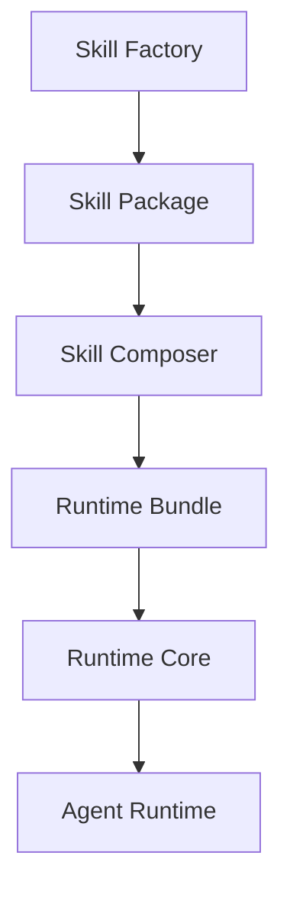

# Skill Cortex

[](https://github.com/alvarolorentedev/crazy-coding-llm/actions/workflows/pytest.yml)
[](https://github.com/alvarolorentedev/crazy-coding-llm/actions/workflows/demo.yml)
[](LICENSE)
[](pyproject.toml)

Skill Cortex is a package manager and runtime for AI coding capabilities.

Instead of shipping one larger fine-tune, Skill Cortex packages specialized LoRA
skills as self-describing artifacts, composes those artifacts into deterministic
runtime bundles, and runs local coding workflows on top of the same runtime
core.

The package is the unit of distribution.
The runtime bundle is the unit of deployment.
The runtime is the unit of execution.

## Why Skill Cortex?

Most coding-agent stacks treat model adaptation, deployment, and agent behavior
as one opaque system. Skill Cortex separates those concerns:

- package a capability once as a reusable skill artifact
- compose multiple skills into one runtime bundle without mutating source assets
- validate the bundle before inference or serving
- run a bounded local agent against the same runtime the CLI and server use

This repository keeps the original research workflow, but the canonical public
product surface is `skillcortex`.

## Product Overview

Skill Cortex v0.1 ships one narrow but complete path from checked-in adapters to
an executable local agent workflow:



### Product layers

- Skill Factory: package an adapter plus provenance into a validated skill
  artifact
- Skill Composer: combine validated skill packages into a deterministic runtime
  bundle
- Runtime Core: validate, route, infer, and serve from a runtime bundle
- Agent Runtime: run a bounded local repository task loop on top of Runtime Core

Deep-dive docs:

- [Skill Factory](docs/architecture/skill-factory.md)
- [Skill Composer](docs/architecture/skill-composer.md)
- [Runtime Core](docs/architecture/runtime-core.md)
- [Agent Runtime](docs/architecture/agent-runtime.md)
- [Skill Package Contract](docs/skill-package-contract.md)
- [Repo Boundary Map](docs/repo-boundary-map.md)

## Support Matrix

| Scenario | Status | Notes |
| --- | --- | --- |
| Package, compose, validate, and no-model demo | Supported | Documented for macOS with Python 3.11+ |
| Real runtime inference | Supported with constraints | Requires model-compatible local environment; current research path is Apple Silicon-first because of `mlx-lm` |
| Compatibility server | Supported | Minimal, non-streaming OpenAI-compatible surface |
| Bounded local agent | Supported | Local single-run workflow only |
| Linux and Windows | Not yet documented | Treat as experimental until verified and documented |

## Install

### Recommended local setup

```bash
python3 -m venv .venv
. .venv/bin/activate
pip install --upgrade pip
pip install -e '.[test]'
```

Check the canonical public CLI:

```bash
python -m skillcortex --help
```

### Platform guidance

- Python 3.11+ is required
- The documented no-model demo avoids model downloads and weight loading
- Real model execution currently follows the repository's Apple Silicon-first
  `mlx-lm` research environment

## Quickstart: No-Model Demo

A first-time developer should start here. This flow uses checked-in fixtures,
checked-in adapter artifacts, and dry-run runtime/agent steps.

```bash
DEMO_ROOT="$(mktemp -d "${TMPDIR:-/tmp}/skillcortex-demo.XXXXXX")"
python scripts/run_skillcortex_demo.py --output-root "$DEMO_ROOT"
```

What the demo validates:

- packaging existing adapters into self-describing skill packages
- composing those packages into one runtime bundle
- validating the runtime bundle before execution
- dry-run routing for inference without loading a model
- bounded agent control flow against a local repository

Expected outputs under `$DEMO_ROOT`:

```text
python_skill/
debugging_skill/
runtime/
agent-trace.json
```

For the command-by-command version of the same flow, see [examples/README.md](examples/README.md).

## CLI Overview

Skill Cortex ships one public CLI with command-specific help and examples.

| Command | Purpose |
| --- | --- |
| `skillcortex train-skill` | train one built-in research skill and package it as a Skill Cortex artifact |
| `skillcortex package-skill` | package an existing adapter into a self-describing skill artifact |
| `skillcortex validate-skill-package` | verify package structure, fingerprints, and protected inputs |
| `skillcortex compose-skills` | compose validated skill packages into a deterministic runtime bundle |
| `skillcortex validate-runtime` | verify a runtime bundle before inference or serving |
| `skillcortex infer` | run local inference or dry-run routing against a runtime bundle |
| `skillcortex serve` | expose the minimal OpenAI-compatible compatibility server |
| `skillcortex agent run` | run the bounded local agent workflow against a local repository |

Use `skillcortex <command> --help` for command-specific examples.

## Common Workflows

### Create a skill package

```bash
skillcortex package-skill \
  --skill-id python_skill \
  --name "Python Skill" \
  --adapter-dir artifacts/adapters/python_skill \
  --train-dataset tests/fixtures/skillcortex_demo/train.jsonl \
  --eval-dataset tests/fixtures/skillcortex_demo/eval.jsonl \
  --eval-summary tests/fixtures/skillcortex_demo/eval-summary.json \
  --output /tmp/skillcortex-demo/python_skill
```

### Compose multiple skills into a runtime bundle

```bash
skillcortex compose-skills \
  --skills /tmp/skillcortex-demo/python_skill,/tmp/skillcortex-demo/debugging_skill \
  --strategy routed \
  --output /tmp/skillcortex-demo/runtime
```

### Validate and dry-run the runtime

```bash
skillcortex validate-runtime --runtime /tmp/skillcortex-demo/runtime

skillcortex infer \
  --runtime /tmp/skillcortex-demo/runtime \
  --request-file tests/fixtures/skillcortex_demo/request.json \
  --dry-run
```

### Serve a runtime bundle

```bash
skillcortex serve --runtime /tmp/skillcortex-demo/runtime --host 127.0.0.1 --port 8000
```

### Run the bounded local agent

```bash
skillcortex agent run \
  --runtime /tmp/skillcortex-demo/runtime \
  --repo /tmp/skillcortex-demo/toy-repo \
  --task "Fix the failing answer implementation." \
  --dry-run \
  --trace-out /tmp/skillcortex-demo/agent-trace.json
```

## v0.1 Limitations

Skill Cortex v0.1 is intentionally narrow.

- The documented demo flow does not retrain models or download model weights
- The demo validates routing and control flow, not model quality
- `compose-skills` currently supports only the `routed` strategy
- The compatibility server is intentionally minimal and non-streaming
- Agent Runtime is a bounded local task runner, not a full IDE agent
- Runtime bundles, not raw registry files, are the runtime source of truth

## Research Surface And Backward Compatibility

The underlying research CLI remains available as `skill-lattice`, but it is not
the primary public entry point for v0.1.

Research-oriented docs live here:

- [Research Workflow](docs/research-workflow.md)
- [Research Results](docs/research-results.md)
- [Five-Seed Artifact Resume](docs/five-seed-artifact-resume.md)

## Contributing And Release Notes

- [Contributing Guide](CONTRIBUTING.md)
- [Changelog](CHANGELOG.md)
- [v0.1.0 Release Notes](docs/releases/v0.1.0.md)
