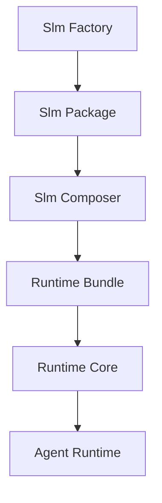

# Slm Cortex

[](https://github.com/alvarolorentedev/crazy-coding-llm/actions/workflows/pytest.yml)
[](https://github.com/alvarolorentedev/crazy-coding-llm/actions/workflows/demo.yml)
[](LICENSE)
[](pyproject.toml)

Slm Cortex is a package manager and runtime for AI coding capabilities.

Instead of shipping one larger fine-tune, Slm Cortex packages specialized LoRA
slms as self-describing artifacts, composes those artifacts into deterministic
runtime bundles, and runs local coding workflows on top of the same runtime
core.

The package is the unit of distribution.
The runtime bundle is the unit of deployment.
The runtime is the unit of execution.

## Why Slm Cortex?

Most coding-agent stacks treat model adaptation, deployment, and agent behavior
as one opaque system. Slm Cortex separates those concerns:

- package a capability once as a reusable slm artifact
- compose multiple slms into one runtime bundle without mutating source assets
- validate the bundle before inference or serving
- run a bounded local agent against the same runtime the CLI and server use

## Product Overview

Slm Cortex v0.1 ships one narrow but complete path from checked-in adapters to
an executable local agent workflow:



### Product layers

- Slm Factory: package an adapter plus provenance into a validated slm
  artifact
- Slm Composer: combine validated slm packages into a deterministic runtime
  bundle
- Runtime Core: validate, route, infer, and serve from a runtime bundle
- Agent Runtime: run a bounded local repository task loop on top of Runtime Core

Deep-dive docs:

- [User Quickstart](docs/user-guide/quickstart.md)
- [Packaged Install](docs/user-guide/packaged-install.md)
- [Local Coding Agent Setup](docs/user-guide/local-coding-agent-setup.md)
- [Command Reference](docs/user-guide/command-reference.md)
- [Slm Factory](docs/architecture/slm-factory.md)
- [Slm Composer](docs/architecture/slm-composer.md)
- [Runtime Core](docs/architecture/runtime-core.md)
- [Agent Runtime](docs/architecture/agent-runtime.md)
- [Slm Package Contract](docs/slm-package-contract.md)
- [Repo Boundary Map](docs/repo-boundary-map.md)

## Support Matrix

| Scenario | Status | Notes |
| --- | --- | --- |
| Package, compose, validate, and no-model demo | Supported | Python 3.11+ |
| Real runtime inference | Supported with constraints | MLX on Apple Silicon; GGUF on Linux, Windows, and macOS Intel |
| Compatibility server | Supported | Minimal, non-streaming OpenAI-compatible surface |
| Bounded local agent | Supported | Local single-run workflow only |
| Linux and Windows | Supported for GGUF validation/runtime path | Real training/inference still requires local model/tooling setup |

## Install

### Recommended local setup

```bash
python3 -m venv .venv
. .venv/bin/activate
pip install --upgrade pip
pip install -e '.[test]'
```

Real model backends are optional:

```bash
pip install -e '.[mlx]'   # macOS Apple Silicon
pip install -e '.[gguf]'  # Linux, Windows, macOS Intel, or explicit GGUF use
```

Check the canonical public CLI:

```bash
python -m slmcortex --help
python -m slmcortex doctor
```

### Platform guidance

- Python 3.11+ is required
- The documented no-model demo avoids model downloads and weight loading
- `backend: auto` uses MLX only on macOS arm64/aarch64; Linux, Windows, and
  macOS Intel default to GGUF
- Explicit `backend: mlx` is rejected outside macOS Apple Silicon
- GGUF configs must point `model`/`default_runtime_model` at a `.gguf` file and
  set `gguf_converter` for training or import conversion

## Quickstart: No-Model Demo

A first-time developer should start here. This flow uses checked-in fixtures,
checked-in adapter artifacts, and dry-run runtime/agent steps.

For the packaged Composer-first contract, use [docs/user-guide/packaged-install.md](docs/user-guide/packaged-install.md) and start with `slmcortex doctor` plus `slmcortex compose-folder`.

```bash
DEMO_ROOT="$(mktemp -d "${TMPDIR:-/tmp}/slmcortex-demo.XXXXXX")"
python scripts/run_slmcortex_demo.py --output-root "$DEMO_ROOT"
```

What the demo validates:

- packaging existing adapters into self-describing slm packages
- composing those packages into one runtime bundle
- validating the runtime bundle before execution
- dry-run routing for inference without loading a model
- bounded agent control flow against a local repository

Expected outputs under `$DEMO_ROOT`:

```text
python_slm/
debugging_slm/
runtime/
agent-trace.json
```

For the command-by-command version of the same flow, see [examples/README.md](examples/README.md).

## Optional Local Validation: Arbitrary Slm Smoke

Keep the no-model demo above as the default quickstart. Use this separate flow only when you want to validate the product path for an arbitrary slm ID such as `fastapi_contract`.

Default no-model arbitrary-slm smoke:

```bash
SMOKE_ROOT="$(mktemp -d "${TMPDIR:-/tmp}/slmcortex-fastapi-contract.XXXXXX")"
python scripts/run_slmcortex_arbitrary_slm_smoke.py --output-root "$SMOKE_ROOT"
```

What the default smoke validates:

- package-first arbitrary slm metadata for `fastapi_contract`
- compose without registry
- runtime bundle validation
- inference dry-run against the composed bundle
- bounded agent dry-run against a local toy repository

Opt-in real local training smoke:

```bash
SMOKE_ROOT="$(mktemp -d "${TMPDIR:-/tmp}/slmcortex-fastapi-contract-real.XXXXXX")"
python scripts/run_slmcortex_arbitrary_slm_smoke.py --output-root "$SMOKE_ROOT" --real-training
```

What the opt-in path additionally validates:

- `slmcortex train-slm --slm-id fastapi_contract` using the tiny fixture in [examples/fastapi_contract_tiny/README.md](examples/fastapi_contract_tiny/README.md)
- real local trainer execution
- real local evaluator execution before packaging

Local assumptions and expected runtime:

- `backend: auto` chooses MLX on Apple Silicon and GGUF elsewhere.
- MLX training uses `mlx-lm` and writes `adapter/adapters.safetensors`.
- GGUF training uses PEFT, converts the LoRA with llama.cpp tooling, and writes `adapter/adapter.gguf`.
- Expect the real-training path to be slow compared with the no-model demo. Runtime depends on local hardware, Python environment, and whether model weights must download on first use.
- Treat the real-training path as a manual smoke check, not a normal development loop.
- To skip it, do nothing extra: the default public quickstart and the default arbitrary-slm smoke both avoid real training.
- This path is not part of normal CI and should not be added to default test commands.

Dynamic adaptive prototype smoke:

```bash
SMOKE_ROOT="$(mktemp -d "${TMPDIR:-/tmp}/slmcortex-dynamic.XXXXXX")"
python scripts/run_dynamic_adaptive_smoke.py --output-root "$SMOKE_ROOT"
python scripts/benchmark_dynamic_router.py --slms-dir slms
```

Manual real path, which may download models/LoRAs and run local training:

```bash
SLMCORTEX_BASE_CONFIG=configs/prototype.yaml \
python scripts/run_dynamic_adaptive_smoke.py --real --output-root "$SMOKE_ROOT"
```

## CLI Overview

Slm Cortex ships one public CLI with command-specific help and examples.

| Command | Purpose |
| --- | --- |
| `slmcortex doctor` | inspect packaged-app readiness, workspace layout, and backend availability |
| `slmcortex compose-folder` | scan one folder, route the best packages, compose a runtime, and optionally export it |
| `slmcortex generate-dataset` | generate deterministic train/eval JSONL datasets for product `train-slm` |
| `slmcortex validate-dataset` | validate product train/eval datasets and write a report JSON |
| `slmcortex train-slm` | train a new LoRA slm from datasets and package it as a Slm Cortex artifact |
| `slmcortex package-slm` | package an already-trained adapter into a self-describing slm artifact |
| `slmcortex validate-slm-package` | verify package structure, fingerprints, and protected inputs |
| `slmcortex compose-slms` | compose validated slm packages into a deterministic runtime bundle |
| `slmcortex route` | route a task against discovered slm packages without loading adapters |
| `slmcortex validate-runtime` | verify a runtime bundle before inference or serving |
| `slmcortex infer` | run local inference or dry-run routing against a runtime bundle |
| `slmcortex serve` | expose the minimal OpenAI-compatible compatibility server |
| `slmcortex agent run` | run the bounded local agent workflow against a local repository |

Use `slmcortex <command> --help` for command-specific examples.

Advanced Factory mode remains available for dataset generation, training, packaging, and import, but it is now entered explicitly so the normal Composer install path stays focused:

```bash
slmcortex factory --help
slmcortex factory doctor
```

Use `slmcortex factory doctor` before training if you are not sure the optional local training dependencies are installed. Dataset generation and dataset validation still work in the base install.

## Common Workflows

### Generate, train, compose, and infer

The beginner path starts with deterministic dataset generation, then training, composition, and inference. The generic product dataset contract is JSONL with one row per example using required fields `id`, `task_type`, `prompt`, and `target`. Optional fields such as `execution`, `group`, `metadata`, `slms`, and `semantic_family` are preserved when present.

`slmcortex generate-dataset` writes both train and eval datasets using that schema, then emits a dataset report JSON with counts, warnings, SHA-256 hashes, diversity stats, leakage results, and example previews.

```bash
slmcortex generate-dataset \
  --slm-id fastapi_contract \
  --domain fastapi
```

Defaults for the beginner command are `task_type=python_generation`, `num_examples=100`, `seed=42`, `output=datasets/<slm_id>/train.jsonl`, and `eval_output=datasets/<slm_id>/eval.jsonl`. Advanced users can still override any of those flags explicitly.

`train-slm` runs dataset validation as a mandatory preflight and fails early on malformed, duplicate, leaky, or obviously degenerate datasets.

```bash
slmcortex factory train-slm \
  --slm-id fastapi_contract \
  --name "FastAPI Contract Slm" \
  --train-dataset datasets/fastapi_contract/train.jsonl \
  --eval-dataset datasets/fastapi_contract/eval.jsonl \
  --output slms/fastapi_contract
```

```bash
slmcortex compose-slms \
  --slms slms/fastapi_contract \
  --output runtime/fastapi_contract
```

```bash
slmcortex infer \
  --runtime runtime/fastapi_contract \
  --prompt "Create a FastAPI POST endpoint for invoices with request validation." \
  --dry-run
```

If you want an explicit dataset quality gate before training, run the optional validator yourself:

```bash
slmcortex factory validate-dataset datasets/fastapi_contract/train.jsonl \
  --eval-dataset datasets/fastapi_contract/eval.jsonl
```

Initial built-in dataset generation support is template-based and local-only for the `fastapi_contract` domain. It covers GET endpoints, POST endpoints, path params, query params, request bodies, response models, error handling, dependency injection, status codes, and Pydantic validation without requiring any external LLM API.

When omitted for arbitrary `--slm-id`, composition metadata defaults to `allowed_task_types=["python_generation"]` and `activation.scope="task"`. Pass explicit routing flags when you want something narrower or semantic-family scoped.

Canonical built-in slms such as `python_slm`, `debugging_slm`, and `test_generation_slm` still work as legacy preset shortcuts:

```bash
slmcortex factory train-slm python_slm --output /tmp/slmcortex-demo/python_slm
```

### Discover and route slms without a runtime

Auto-discovery mode scans slm folders for `slm.yaml` and optional routing
metadata. It is deterministic and route-only; it does not load adapter weights.
`task_type` is only a compatibility hint in this mode.

```bash
slmcortex route \
  --slms-dir slms \
  --repo . \
  --task "Create a FastAPI endpoint with Pydantic validation" \
  --explain
```

```bash
slmcortex agent run \
  --slms-dir slms \
  --repo . \
  --task "Create a FastAPI endpoint with Pydantic validation" \
  --dry-run
```

To run the four-scenario dynamic acceptance harness locally:

```bash
python scripts/run_dynamic_agent_acceptance_harness.py --output-root /tmp/slmcortex-dynamic-agent-harness
```

### Package an existing adapter

```bash
slmcortex factory package-slm \
  --slm-id python_slm \
  --name "Python Slm" \
  --adapter-dir artifacts/adapters/python_slm \
  --train-dataset tests/fixtures/slmcortex_demo/train.jsonl \
  --eval-dataset tests/fixtures/slmcortex_demo/eval.jsonl \
  --eval-summary tests/fixtures/slmcortex_demo/eval-summary.json \
  --output /tmp/slmcortex-demo/python_slm
```

### Compose multiple slms into a runtime bundle

```bash
slmcortex compose-slms \
  --slms /tmp/slmcortex-demo/python_slm,/tmp/slmcortex-demo/debugging_slm \
  --output /tmp/slmcortex-demo/runtime
```

### Validate and dry-run the runtime

```bash
slmcortex validate-runtime --runtime /tmp/slmcortex-demo/runtime

slmcortex infer \
  --runtime /tmp/slmcortex-demo/runtime \
  --request-file tests/fixtures/slmcortex_demo/request.json \
  --dry-run
```

### Serve a runtime bundle

```bash
slmcortex serve --runtime /tmp/slmcortex-demo/runtime --host 127.0.0.1 --port 8000
```

### Run the bounded local agent

Execution mode still uses an explicit composed runtime bundle:

```bash
slmcortex agent run \
  --runtime /tmp/slmcortex-demo/runtime \
  --repo /tmp/slmcortex-demo/toy-repo \
  --task "Fix the failing answer implementation." \
  --dry-run \
  --trace-out /tmp/slmcortex-demo/agent-trace.json
```

## v0.1 Limitations

Slm Cortex v0.1 is intentionally narrow.

- The documented demo flow does not retrain models or download model weights
- The demo validates routing and control flow, not model quality
- `compose-slms` currently supports only the `routed` strategy
- The compatibility server is intentionally minimal and non-streaming
- Agent Runtime is a bounded local task runner, not a full IDE agent
- Runtime bundles, not raw registry files, are the runtime source of truth

## Contributing And Release Notes

- [Contributing Guide](CONTRIBUTING.md)
- [Changelog](CHANGELOG.md)
- [v0.1.0 Release Notes](docs/releases/v0.1.0.md)
